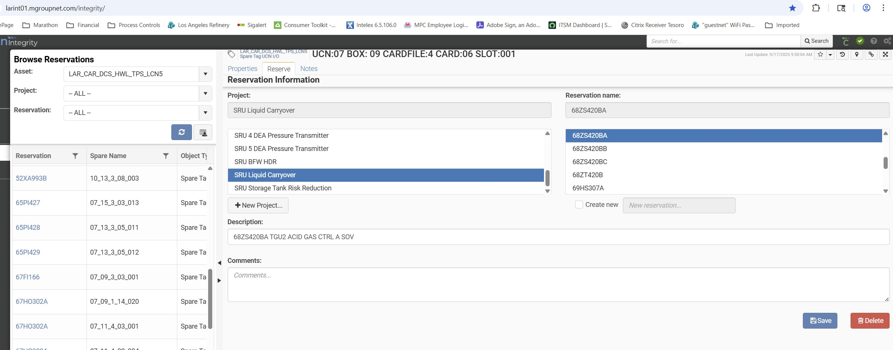
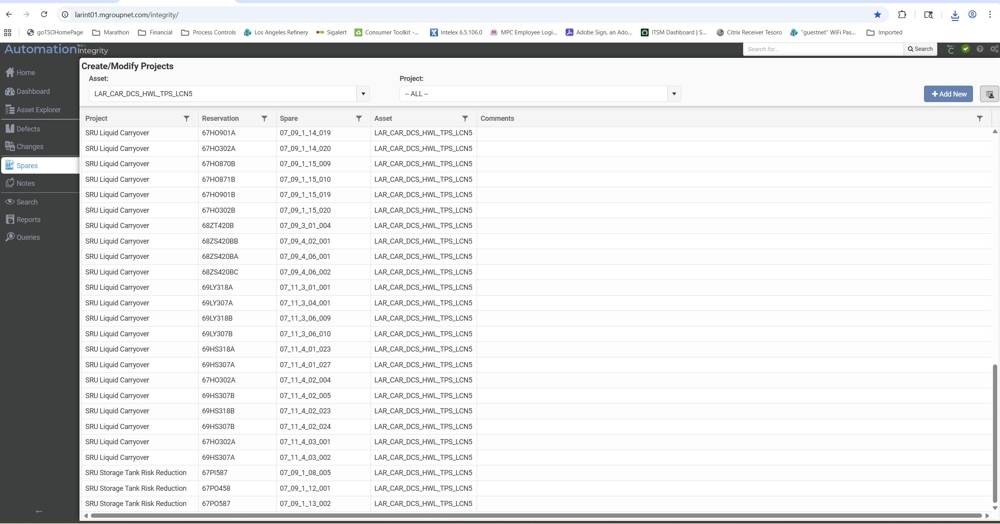

# Integrity Spares Address Reservation Instructions

## Purpose
This document provides step-by-step instructions for reserving spare I/O slots, cards, and addresses in the Automation Integrity system using the Spares Management feature.

---

## Overview
The Spares Management tool identifies spare capacity of automation objects and allows users to reserve and manage slot/address reservations for projects such as turnarounds, upgrades, or new installations.

---

## Part 1: Creating a Reservation Project

### Purpose
Create a project container to organize and group related address reservations.

### Steps

1. **Access Spares Management**
   - From the top toolbar, hover over the **Spares** tab
   - Select **Browse Projects** from the drop-down menu

2. **Select Asset (REQUIRED)**
   - **Choose an Asset from the list** - This must be done first
   - All reservations are Asset-specific

3. **Create New Project**
   - Click **Add New**

4. **Enter Project Details**
   - **Project Name:** Enter a descriptive name (e.g., "Spring Turnaround", "Unit 5 Upgrade")
   - **Description:** Provide project description
   - **Comments:** Add any relevant notes or additional information

5. **Save the Project**
   - Click **Save** to create the project

---

## Part 2: Browsing and Reserving Spare Addresses

### Purpose
Find available spare slots/addresses and reserve them for your project.

### Steps

1. **Browse Available Spares**
   - From the top toolbar, hover over the **Spares** tab
   - Select **Browse Spares** from the drop-down menu

2. **Select Asset (REQUIRED)**
   - **Choose an Asset from the list** - This must be done first

3. **Filter Spare Objects (Optional)**
   - **Object Type:** Select the type (e.g., "Spare CardUCN", "Spare I/O Card"), or leave blank for all
   - **Spare Type:** Select specific type, or leave blank to show all types

4. **Refine Search (Optional)**
   - Click **Show advanced options** link
   - Enter additional criteria such as Node number or location
   - Click **Add** to apply filters and refine results

5. **Select Spares to Reserve**
   - Check the box next to spare(s) you want to reserve
   - Multiple selections are allowed if making reservations for the same project
   - Click **Reserve**

6. **Complete Reservation Details**
   - **Choose Project:** Select your project from the list
   - Select **Create New Reservation Name**
   - **Reservation Name:** Enter the **tag name** if available (this makes it easier to identify what has been reserved when managing or exporting reservations later)
     - *Best Practice:* Use the tag name, NOT your personal name
     - *If tag name unavailable:* Use "unknown1", "unknown2", "unknown3", etc. (increment the number)
     - *Avoid:* Using your name (e.g., "John's Reservation") as this requires additional clicking to determine which tags are reserved
   - **Description:** Enter the **tag description** if available
   - **Comments:** Add notes about planned usage
   - Click **Save**

*Example of a properly completed reservation using tag name*

---

## Part 3: Managing Existing Reservations

### Viewing Reservations

1. **Browse Reservations**
   - From the top toolbar, hover over the **Spares** tab
   - Select **Browse Reservations** from the drop-down menu

2. **Select Asset (REQUIRED)**
   - **Choose an Asset from the list** - This must be done first

3. **Filter Results (Optional)**
   - Additional filtering by **Project name**
   - Filter by **Project name**
   - Filter by **Reservation name**

### Removing a Reservation

1. **Open the Reservation**
   - Click the reserved item hyperlink

2. **Remove the Reservation**
   - Click **Remove**
   - When prompted to confirm, click **OK**

---

## Part 4: Exporting Reservation Data

### Purpose
Export reservation details to share with contractors or for documentation.

### Steps

1. **Access Reservation Properties**
   - Navigate to the reservation you want to export
   - View the properties of the reservation

2. **Export to Excel**
   - Export the reservation data to MS Excel
   - Save the Excel file for distribution

*Export view showing cleaner results when using tag names in Reservation field*

---

## Best Practices

- Create separate projects for major initiatives (turnarounds, upgrades, new installations)
- **Use tag names for Reservation Names** to easily identify what has been reserved
  - If tag name is unavailable, use "unknown1", "unknown2", etc.
  - Do NOT use personal names (e.g., "John's Reservation")
- **Use tag descriptions in the Description field** when available
- Include detailed comments about intended use and any dependencies
- Review reservations regularly and remove unused reservations
- Export reservation lists before contractor work begins

---

## Support

For questions or support:
- Email: **lar-integrityrequests@marathonpetroleum.com**
- Reference: INT-101 Training Manual, Spares Management section

---

*Document created: January 2026*  
*Source: Automation Integrity INT-101 Training Manual*
