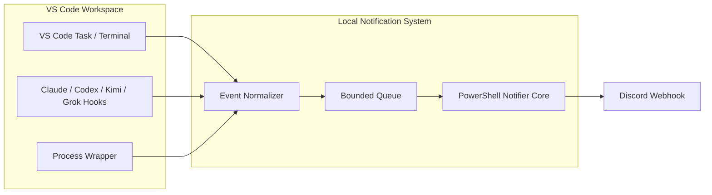
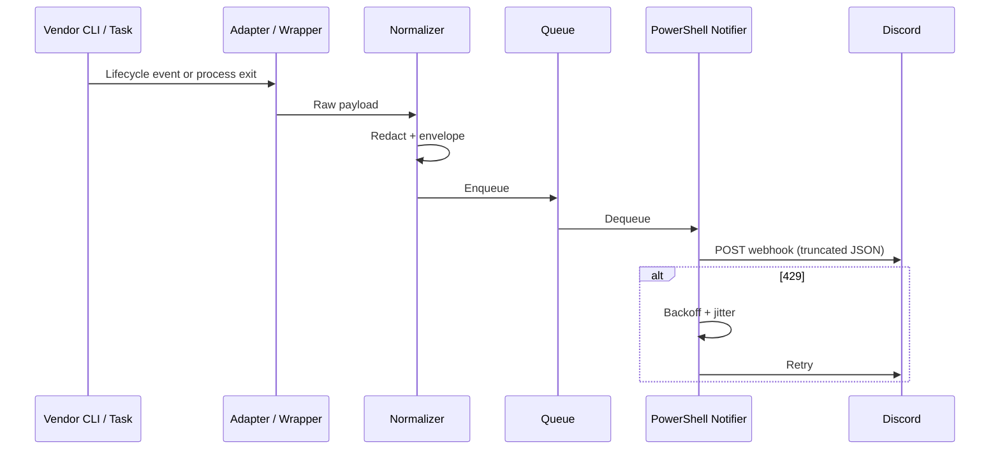

# AI CLI Discord Integration Architecture

**Document status:** Architecture only (no implementation, deployment, or testing performed)  
**Target environment:** Windows + VS Code integrated terminal + CLI-first workflows  
**Date context:** Verified against official sources as of August 2026  
**Scope:** One-way notifications MVP; two-way treated as optional future work

---

## 1. Executive Recommendation

**Recommended VS Code-centric MVP:** A shared PowerShell notifier core that posts redacted, schema-versioned events to a Discord webhook. Capture events via a generic process/Task wrapper plus the best-supported native vendor hooks (Claude Code first). No AI model is invoked to send notifications; no API credits are required for the notification path itself.

**Shared across all vendors:** Event envelope, PowerShell notifier (JSON encoding, secret handling via environment variable or user secret store, truncation, rate-limit awareness, bounded retry with jitter, local queue, redaction, non-blocking behavior), portable `.vscode/tasks.json` templates, workspace-name / project alias / machine-alias metadata, and duplicate-suppression rules.

**Vendor adapters needed:** Thin normalizers that map each surface’s lifecycle events (or process exit) into the shared envelope. Prefer documented hooks where available; fall back to Task wrappers or process wrappers where hooks are missing or platform-limited.

**Do not build yet:** Two-way Discord command control, custom VS Code extension, persistent local daemon, database, MCP server for notifications, cloud relay, terminal keystroke injection, or any path that requires separately billed API credits solely for status reporting.

This keeps the system CLI-first, Windows-native, secret-safe, and natural inside VS Code projects.

---

## 2. Verified Capability Matrix

Columns reflect official documentation only. “Not verified from official documentation” is used where sources do not establish the capability. Confidence is High / Medium / Low based on primary-source clarity and recency.

| Vendor | Exact product/surface | Official status | Windows support | VS Code integration | Lifecycle events | Local command hooks | Programmatic input | Session identification | Subscription entitlement | API billing required | Recommended integration tier | Confidence | Official sources |
|--------|-----------------------|-----------------|-----------------|---------------------|------------------|---------------------|--------------------|------------------------|--------------------------|----------------------|------------------------------|------------|------------------|
| Anthropic | Claude Code CLI | GA / full-featured | Yes | Legacy terminal integration + official VS Code extension (beta) | SessionStart, SessionEnd, UserPromptSubmit, PreToolUse, PostToolUse, PostToolUseFailure, PermissionRequest, Stop, StopFailure, Notification, Subagent*, Task*, and many others | Yes – command / HTTP / prompt / agent hooks in settings | Via hooks and Agent SDK surfaces | Session IDs present in hook payloads | Pro/Max subscription covers Claude Code CLI + IDE | No for CLI/IDE usage under subscription; API is separate | Native hooks (primary) | High | code.claude.com/docs/en/hooks, code.claude.com/docs/en/vs-code, support.claude.com |
| Anthropic | Claude Code VS Code extension | Beta | Yes | Native sidebar panel; shares settings/hooks with CLI | Same hook events as CLI (hooks fire across surfaces) | Yes – same settings.json hooks | Limited relative to CLI | Shared with CLI | Same subscription | No under subscription | Native hooks | High | code.claude.com/docs/en/vs-code |
| OpenAI | Codex CLI | GA (hooks experimental) | Hooks temporarily disabled on Windows (per docs) | CLI runnable in integrated terminal; separate IDE extension | SessionStart, SessionEnd, PreToolUse, PostToolUse, PermissionRequest, UserPromptSubmit, Stop, Subagent*, Pre/PostCompact | Yes – hooks.json / config.toml (feature-flagged) | Via hooks | Session context in hooks | ChatGPT/Codex subscription for product; hooks independent of billing for local scripts | API separate if using Responses/API | Process/Task wrapper (hooks limited on Windows) | Medium | developers.openai.com/codex/hooks |
| OpenAI | Codex IDE extension | Available | Yes | Sidebar / editor panels | Not verified as exposing the same CLI hook surface | Not verified from official documentation | Not verified | Not verified | Subscription for product | API separate | Task / process observation | Low–Medium | developers.openai.com/codex/ide |
| Moonshot / Kimi | Kimi Code CLI | GA (Node.js rewrite) | Yes (install script + Git Bash) | Official VS Code extension; ACP support | UserPromptSubmit, PreToolUse, PostToolUse, PostToolUseFailure, Stop, StopFailure, SessionStart/End, Subagent*, Pre/PostCompact, Notification | Yes – `[[hooks]]` in config.toml | Via hooks | Session context available | Kimi Code membership / subscription | API key mode is separately billed | Native hooks | High | kimi.com/code/docs, moonshotai.github.io/kimi-code |
| Moonshot / Kimi | Kimi Code VS Code extension | Available | Yes | Native panel; shares config with CLI when KIMI_CODE_HOME matches | Not verified as independent hook surface beyond CLI | Not verified independently | Not verified | Shared when home matches | Same membership | API key alternative | Native hooks via CLI + Task fallback | Medium | marketplace + kimi.com/code/docs |
| xAI | Grok Build CLI (`grok`) | GA | Yes (PowerShell install) | No first-party VS Code extension; community extensions + ACP; Kilo Code OAuth path | SessionStart/End, UserPromptSubmit, PreToolUse, PostToolUse, PostToolUseFailure, PermissionDenied, Stop, StopFailure, Notification, Subagent*, Pre/PostCompact | Yes – Claude-compatible JSON hooks in `~/.grok/hooks` / project `.grok/hooks` | Via hooks + ACP | sessionId in hook payload | SuperGrok / X Premium+ / free trial tiers; API key alternative | API key is separately billed | Native hooks | High | x.ai/docs/build/features/hooks, x.ai/cli, docs.x.ai |
| xAI | Grok API / SDK | Available | N/A | Via third-party | N/A for local lifecycle | N/A | Full | N/A | API key | Yes | Not for local notifications | High | docs.x.ai |
| Microsoft | VS Code Tasks | Core product | Yes | Native | Task start / exit / problem-matcher events | Via task definition + problem matchers | Limited (dependsOn, inputs) | Workspace / task label | N/A | N/A | Reusable Task wrapper | High | code.visualstudio.com/docs (Tasks) |
| Microsoft | `code` CLI | Core product | Yes | Opens folders/files, runs commands | Not a session observer | Limited | Can open files / execute some commands | Workspace folder | N/A | N/A | Not primary for terminal sessions | High | code.visualstudio.com/docs/editor/command-line |
| Discord | Incoming Webhooks | Stable | N/A | N/A | N/A | N/A | N/A | N/A | N/A | N/A | One-way delivery | High | discord.com/developers/docs/resources/webhook, rate-limits docs |

**Subscription boundary notes (explicit):**
- Claude Code under Pro/Max: subscription-authenticated CLI + extension; no extra API credits required for normal interactive use.
- Codex: product access via ChatGPT/Codex plans; local hooks are scripts, not API calls.
- Kimi Code: membership covers CLI/extension; API-key mode is pay-as-you-go.
- Grok Build: SuperGrok / X Premium+ / trial for agent; API key is separate billing.
- None of the notification paths proposed below require calling a vendor model or consuming API tokens merely to emit a Discord message.

---

## 3. VS Code Integration Decision

| Approach | Complexity | Reliability | Portability | Concurrent-session handling | Security | Maintenance | Score (1–5) |
|----------|------------|-------------|-------------|-----------------------------|----------|-------------|-------------|
| Native vendor hooks | Low–Medium | High (where documented) | High (settings files) | Good (session IDs) | High (local scripts) | Low | 4.5 |
| VS Code Tasks + problem matchers | Low | Medium–High (exit codes) | High (`.vscode/tasks.json`) | Medium (task labels) | High | Low | 4 |
| PowerShell process wrapper | Low | Medium (exit + optional log scrape) | High | Medium | High if redacted | Low | 3.5 |
| Custom VS Code extension | High | High (if well-written) | Medium | Excellent | Needs careful review (Secret Storage, Trust) | High | 2.5 |
| Persistent local daemon | High | High | Medium | Excellent | Attack surface | High | 2 |

**MVP recommendation:**  
1. Shared PowerShell notifier.  
2. Reusable VS Code Task that wraps any CLI/command and emits start/complete/fail events.  
3. First native adapter for Claude Code hooks (richest, Windows-friendly, subscription-covered).  
4. Process-wrapper fallback for Codex (Windows hook limitations), Kimi, and Grok when hooks are not configured or not desired.

**Future-proof evolution:** Add remaining native hook adapters; only then evaluate a minimal extension if concurrent multi-window routing or richer terminal metadata becomes a hard requirement. A daemon is unnecessary for the one-way MVP.

**Duplicate prevention:** Prefer a single capture path per vendor/session (native hook **or** Task wrapper). Deduplication key = `vendor + session-id (or process-id) + event-type + timestamp-bucket`.

**`code` CLI limitations:** It can open folders, files, and run some commands, but does **not** provide inspection or control of arbitrary integrated-terminal sessions. Do not rely on it for session observation.

---

## 4. Architecture

### Component descriptions
- **Vendor adapters / wrappers** – Emit normalized events (native hooks preferred).
- **Event normalizer** – Maps vendor payloads into the shared envelope; applies redaction.
- **Bounded local queue** – In-memory or simple file-backed queue with max depth; drops oldest on overflow (or coalesces).
- **PowerShell notifier core** – Serializes JSON, respects Discord limits, handles 429s, retries with exponential backoff + jitter, short timeouts, non-blocking.
- **Discord webhook** – One-way delivery only for MVP.
- **Config & secrets** – User-level secret store or environment variable; project-level non-secret routing.

### Trust boundaries
- Local machine (user-controlled scripts and PowerShell).
- Vendor CLI/extension process (trusted only as far as the user already trusts the AI tool).
- Discord webhook endpoint (treat as untrusted network; never send secrets, full paths, prompts, or source).
- No inbound ports required for one-way.

### Mermaid component diagram



### Mermaid sequence diagram (one-way start/complete)



### Shared event schema (conceptual)

```json
{
  "schemaVersion": "1.0",
  "vendor": "claude|codex|kimi|grok|vscode-task|process",
  "toolOrSurface": "cli|extension|task|wrapper",
  "workspaceName": "string",
  "workspacePathAlias": "string (never full sensitive path)",
  "project": "string",
  "task": "string",
  "eventType": "started|completed|failed|waiting_input|permission_required|rate_limit|stopped|unexpected_exit",
  "severity": "info|warning|error",
  "safeSummary": "string (max ~200 chars, redacted)",
  "timestamp": "ISO-8601",
  "machineAlias": "string",
  "vscodeWindowId": "string|null",
  "terminalId": "string|null",
  "vendorSessionId": "string|null",
  "approvalRequestId": "string|null",
  "processExitCode": "number|null",
  "deduplicationKey": "string",
  "redactedMetadata": {}
}
```

### Configuration schema (conceptual)

- User-level: `DISCORD_WEBHOOK_URL` (or equivalent secret), machine alias, default severity filter.
- Workspace-level (committed): event routing preferences, project alias, which adapters are enabled (no secrets).
- Local override (gitignored): optional per-project webhook override only if using a non-secret mechanism; prefer user-level secret.

### Proposed directory layout (conceptual)

```
~/.ai-notify/                 # user-level scripts & config (non-secret)
  notifier.ps1
  queue/
  logs/                       # redacted, rotated
project/
  .vscode/
    tasks.json                # portable Task templates (no secrets)
  .ai-notify/                 # optional project adapters (no secrets)
```

### Secret-storage design
- Preferred: environment variable `DISCORD_WEBHOOK_URL` set in user profile or VS Code terminal environment.
- Alternative: Windows Credential Manager / user secret store read by the PowerShell notifier.
- Never place the webhook URL in `.vscode/settings.json`, `.vscode/tasks.json`, or any committed file.

### Event routing & deduplication
- Route by `project` / `workspaceName` / severity if multiple webhooks are configured.
- Deduplication window: short (e.g., 5–30 s) keyed by `deduplicationKey`.
- Coalesce rapid “progress” events into a single summary when possible.

---

## 5. Vendor Adapter Designs

### Claude / Claude Code
- **Best verified capture:** Native hooks (`SessionStart`, `Stop`, `StopFailure`, `PostToolUseFailure`, `PermissionRequest`, `Notification`, etc.) configured in `~/.claude/settings.json` or project `.claude/settings.json`. Hooks receive JSON on stdin and can run any local command.
- **Reliably detectable:** start, completion, failure, permission/approval, stop, many tool-level events.
- **Undetectable / limited:** Arbitrary internal model state not exposed by hooks.
- **Windows / VS Code:** Fully supported; PowerShell scripts can be invoked from hooks.
- **Auth / billing:** Subscription covers CLI + extension; hooks are local commands → no API credits for notifications.
- **Failure behavior:** Hook failures should be fail-open for the AI session; notifier isolates Discord failures.
- **Representative (illustrative only):** Hook command that pipes stdin JSON into the shared normalizer then notifier.

### Codex
- **Best verified capture:** Experimental hooks (`hooks.json` / config.toml) where enabled; on Windows, official docs note temporary disablement → prefer Task / process wrapper.
- **Reliably detectable (via wrapper):** process start, exit code, timeout.
- **Undetectable without hooks:** fine-grained permission or “waiting for input” unless logs are scraped (avoid by default).
- **Windows limitation:** Hooks currently restricted → wrapper is the pragmatic path.
- **Auth / billing:** Local scripts only for notification path.
- **Failure behavior:** Wrapper always reports exit; Discord failures isolated.

### Kimi
- **Best verified capture:** `[[hooks]]` array in config.toml (`PreToolUse`, `PostToolUse`, `Stop`, `SessionStart/End`, `Notification`, etc.).
- **Reliably detectable:** same broad set as other modern agent CLIs.
- **Windows / VS Code:** Official extension + CLI; hooks are shell commands.
- **Auth / billing:** Membership for CLI; hooks local.
- **Fallback:** Task wrapper if hooks not desired.

### Grok (Grok Build CLI)
- **Best verified capture:** Claude-compatible hooks in `~/.grok/hooks` or project `.grok/hooks` (PreToolUse, PostToolUse, Stop, SessionStart/End, Notification, etc.).
- **Reliably detectable:** start, tool events, stop, failure, permission denied.
- **Windows:** Supported via install script; hooks are local commands.
- **Auth / billing:** Subscription / trial for agent; hooks do not consume API credits.
- **VS Code:** No first-party extension; run CLI in integrated terminal or use community/ACP surfaces.

### VS Code Tasks
- **Best verified capture:** Task definition that runs the desired command and uses exit status + optional problem matcher.
- **Reliably detectable:** task started (via presentation or wrapper), completed, failed (non-zero exit).
- **Undetectable:** AI-internal “waiting for input” unless the wrapped process surfaces it.
- **Portable:** Commit a template `tasks.json` that calls the shared wrapper; keep secrets out.

### Generic PowerShell process wrapper
- **Mechanism:** `Start-Process` or `&` invocation that records start time, waits, captures exit code, emits envelope.
- **Events:** started, completed, failed, unexpected exit.
- **Limitations:** No deep visibility into interactive TUI state without additional (and fragile) log scraping — avoid by default.
- **Use when:** Native hooks unavailable or disabled.

---

## 6. Implementation Blueprint

| Stage | Deliverable | Files / settings | Dependencies | Validation method | Binary acceptance criteria | Rollback |
|-------|-------------|------------------|--------------|-------------------|----------------------------|----------|
| 1 | Shared PowerShell notifier | `notifier.ps1`, user env var | PowerShell 5.1+ / 7 | Unit-style mock POST | Posts valid JSON under size limits; respects 429 | Delete script; unset env |
| 2 | Mock webhook receiver | Local HTTP listener or requestbin | None | Manual POST | Receives and logs payload | Stop listener |
| 3 | Generic process wrapper | `wrap.ps1` | Stage 1 | Run known-good / known-fail commands | Emits start + exit events | Remove wrapper |
| 4 | Reusable VS Code Task | `.vscode/tasks.json` template | Stage 3 | Run Task from Command Palette | Task success/fail produces Discord message | Revert tasks.json |
| 5 | First native adapter (Claude) | Hook entries + small PS normalizer | Stage 1 | Trigger SessionStart / Stop | Events appear with correct vendor/session | Disable hooks |
| 6 | Remaining adapters | Kimi / Grok hooks; Codex wrapper | Stage 1 | Same as above | Consistent envelope | Disable per vendor |
| 7 | Reliability & redaction hardening | Queue bounds, retry, redaction tests | All prior | Automated tests + manual | No secrets/paths in payloads; bounded retries | Feature flags |
| 8 | Operational rollout | User docs, example configs | All | Multi-project manual | Stable under concurrent terminals | Disable adapters |

---

## 7. Example Artifacts

**Shared notifier interface (conceptual PowerShell):**
```powershell
# Illustrative only — not verified production syntax
function Send-AiNotifyEvent {
  param([hashtable]$Envelope)
  # redact, truncate, enqueue, POST with retry
}
```

**Portable `.vscode/tasks.json` fragment (conceptual):**
```json
{
  "version": "2.0.0",
  "tasks": [
    {
      "label": "AI: Wrapped Command",
      "type": "shell",
      "command": "powershell",
      "args": ["-File", "${env:USERPROFILE}/.ai-notify/wrap.ps1", "--", "your-cli", "args"],
      "problemMatcher": [],
      "presentation": { "reveal": "always" }
    }
  ]
}
```

**PowerShell wrapper sketch (conceptual):**
```powershell
# Illustrative
$start = Get-Date
# emit "started"
& $Command @Args
$code = $LASTEXITCODE
# emit "completed" or "failed" with $code
```

**Vendor adapter contract (conceptual):**
- Input: vendor-specific JSON on stdin or process exit.
- Output: call to shared normalizer → envelope.

**Redacted Discord message example:**
```
[claude] DealsBot — task completed (exit 0)
workspace: dealsbot | session: a1b2… | 2026-08-21T15:22:00Z
```

**User-level secret configuration:**
```powershell
# User profile or VS Code terminal env — never committed
$env:DISCORD_WEBHOOK_URL = "https://discord.com/api/webhooks/…"
```

---

## 8. Reliability, Security, and Testing

- **Rate limits:** Honor Discord `Retry-After` / `X-RateLimit-*` headers; ~30 messages/min per webhook is a practical conservative budget; global 50 req/s exists for bots but webhooks are route-limited.
- **Retries:** Bounded exponential backoff + jitter; short overall timeout; never block the AI session.
- **Queue:** Max depth (e.g., 50–100); drop or coalesce on overflow.
- **Deduplication:** Time-bucketed key.
- **Redaction:** Strip absolute paths, tokens, prompts, large terminal output by default.
- **Logging:** Local redacted logs with rotation.
- **Webhook compromise:** Rotate URL immediately; treat as public.
- **Multi-workspace:** Use workspaceName + project alias; no full paths.
- **Tests (each with explicit pass/fail):**
  - Mock-webhook receives correctly shaped JSON → pass.
  - Adapter contract produces required envelope fields → pass.
  - Network failure does not crash wrapper → pass.
  - 429 triggers backoff and eventual success or clean drop → pass.
  - Redaction removes known secret patterns → pass.
  - Concurrent sessions produce distinct deduplication keys → pass.
  - Manual Discord acceptance: message appears with correct project label → pass.

---

## 9. Optional Two-Way Architecture

### Per-vendor feasibility (high-level)
| Vendor | Native control surface | Terminal injection | Subscription vs API | Feasibility |
|--------|------------------------|--------------------|---------------------|-------------|
| Claude Code | Hooks + Agent SDK / permission flows | Fragile / unsupported as primary | Subscription for interactive | Medium (safest candidate) |
| Codex | Limited documented control | Not verified | Product + possible API | Low–Medium |
| Kimi | ACP + hooks | Not verified as reliable | Membership | Medium |
| Grok | ACP (`grok agent stdio`) + hooks | Not verified | Subscription / API | Medium |

### Implementation approaches
1. Discord Bot + Gateway (inbound) → local command queue → vendor-native control API/SDK where it exists.
2. Polling a private channel or interaction endpoint (still requires bot).
3. Out-of-band local queue only (user still confirms in VS Code) — safest but limited.

### Decision matrix & recommendation
- Prefer approach 1 only for the vendor with the clearest documented session/permission control (Claude Code currently strongest).
- Mandatory safeguards: allow-lists (user/guild/channel), strict grammar, short-lived request IDs, confirmation gates, audit log, global kill switch, no arbitrary shell, no prompt/shell injection paths, Workspace Trust awareness.
- **No-go conditions:** Any design that injects keystrokes into an interactive TUI without an official interface, requires a public inbound endpoint without strong auth, or forces separately billed API usage solely for control.
- API billing becomes necessary only if the chosen control path is an official cloud/API surface rather than local process control.

Treat terminal keystroke injection as an unsupported last resort.

---

## 10. Phased Backlog and Final Recommendation

| Phase | Deliverable | Acceptance criterion |
|-------|-------------|----------------------|
| 0 | Capability verification (this document) | Matrix rows backed by official links; unknowns labeled |
| 1 | Generic VS Code / PowerShell MVP | Task wrapper + notifier deliver redacted messages to Discord |
| 2 | Native vendor adapters | Claude first; then Kimi & Grok; Codex via wrapper |
| 3 | Hardening | Queue, retry, redaction, concurrent-session tests green |
| 4 | Two-way PoC (optional) | Only for safest vendor; full safeguard checklist |
| 5 | Expansion | Additional surfaces only if MVP remains stable |

**Exact MVP boundary:** One-way notifications via shared PowerShell core + Task wrapper + Claude Code hooks. No two-way, no custom extension, no daemon, no API credits for notifications.

**Recommended first vendor adapter:** Claude Code (richest verified hooks, Windows support, subscription covers the surface).

**Fallback for unsupported vendors:** Generic PowerShell process / VS Code Task wrapper.

**Is a VS Code extension justified?** Not for MVP. Re-evaluate only if concurrent multi-window routing or richer terminal metadata becomes a hard requirement that hooks + Tasks cannot satisfy.

**Relative effort:**  
- Phase 1: S–M  
- Phase 2: M  
- Phase 3: M  
- Phase 4: L–XL (security-sensitive)

**Stop after one-way when:** Notifications are reliable, redacted, and non-blocking; further control is not worth the security surface.

**Justify two-way when:** A single vendor offers a clean, documented, local control path; the user accepts the full safeguard set; and the operational value clearly exceeds the risk.

---

### Separation of concerns (facts vs. design)

- **Facts:** Lifecycle hook existence and names for Claude Code, Kimi, Grok; experimental nature and Windows note for Codex hooks; Discord webhook payload and rate-limit headers; VS Code Tasks exit-status behavior; subscription vs. API boundaries as documented.
- **Design choices:** Shared envelope, PowerShell-first core, Task wrapper as universal fallback, Claude-first native adapter, strict redaction defaults.
- **Unknowns / not verified:** Exact session-ID stability across all surfaces under multi-root workspaces; long-term Windows status of Codex hooks; any undocumented extension-host events.

This architecture stays pragmatic, CLI-first, Windows-compatible, and natural inside VS Code while respecting the hard boundary between subscription-authenticated local tools and separately billed API usage.
