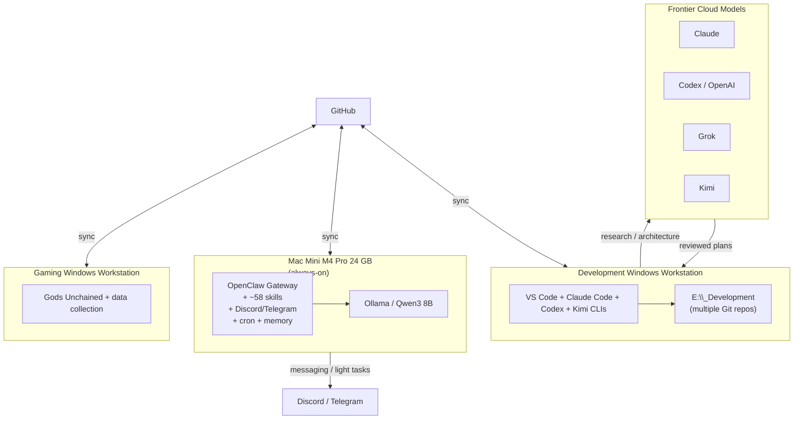
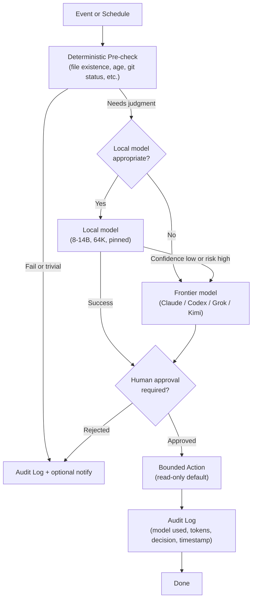

# Workspace AI Automation Optimization Analysis

**Prepared for:** User workspace owner  
**Date:** 2026-08-21  
**Analyst role:** Pragmatic AI-workflow architect  
**Scope:** Three-machine environment, OpenClaw evaluation, Hermes Agent comparison, local-model feasibility on M4 Pro 24 GB, automation prioritization, hybrid escalation design.

All major recommendations are labelled:  
- **Verified fact** (from official docs or matching hardware benchmarks)  
- **Inference from workspace evidence**  
- **Conditional recommendation**  
- **Unknown requiring measurement**

---

## 1. Executive Verdict (≤ 250 words)

Your multi-model review process produces high-quality plans but systematically delays operational value. The July 2026 portfolio audit correctly identified the core failure mode: sophisticated infrastructure (OpenClaw + 58 skills, resource-tools, Discord notifier designs) is built faster than the unglamorous recurring tasks that would use it.  

OpenClaw is already installed, configured with explicit boundaries, messaging, cron, memory, and a local Qwen3 8B path. Hermes Agent is newer, more self-improving, and has stronger official security documentation, but it imposes a hard 64 K context minimum for agentic local models and would require a fresh skills/memory migration. Migrating solely because of social-media exposure is not justified.  

**Recommendation (Conditional):** Keep OpenClaw, simplify its workload to three proven recurring operational tasks, and run a tightly scoped 30-day pilot. Do not uninstall OpenClaw. Do not install Hermes as the primary agent yet. Use the Mac Mini as a reliable always-on deterministic + light-local worker; keep frontier models (Claude, Codex, Grok, Kimi) for architecture, review, and complex coding.  

Success metric for the pilot: measurable increase in completed recurring work (git hygiene reports delivered, HANDOFF freshness, health-log reminders, documentation intake) with no increase in unreviewed autonomous actions.  

If the pilot shows that OpenClaw’s maintenance burden exceeds its output value, then evaluate Hermes or pure scripts. Until then, the highest-leverage move is to stop building new agent frameworks and start closing the operational loop on work already designed.

---

## 2. Evidence-Based Assessment of Current Workflow

**What is already working well**  
- Multi-model independent review catches factual errors and hallucinated capabilities (explicitly demonstrated in the recent Discord-notifier design cycle).  
- Explicit financial, credential, and execution boundaries already exist in the OpenClaw configuration.  
- GitHub synchronization and root-level `CLAUDE.md` / `AGENTS.md` provide a coherent context layer across machines.  
- The Mac Mini is correctly positioned as the always-on worker.

**Where multi-model review genuinely improves quality**  
- Architecture and research questions that will drive non-trivial implementation.  
- Any claim about third-party tool capabilities or vendor hooks.  
- Security or privacy-sensitive decisions.

**Where it creates ceremony and delay**  
- Repeated production of audit documents, architecture prompts, independent reviews, and implementation plans before any operational metric moves.  
- The Discord-notifier design is a clear example: four models produced excellent paper, yet the capability has not yet improved completion of a real workflow.  
**Inference from workspace evidence.**

**Context-maintenance problems**  
Stale `HANDOFF.md`, `_TODO.md`, and dirty repositories are symptoms of the same pattern the July audit named: infrastructure is preferred over the recurring operational step.  
**Inference from workspace evidence.**

**Over-investment in agent infrastructure**  
OpenClaw + ~58 skills + resource-tools indexing + recent notifier architecture work represent significant sunk effort relative to the volume of recurring output currently generated by those systems.  
**Inference from workspace evidence.**

---

## 3. Current-State Diagram



---

## 4. Workload-Routing Matrix (Five Execution Tiers)

| Workload | Tier | Rationale | Best Machine |
|----------|------|-----------|--------------|
| Git status / stale-branch / failed-test / stale-HANDOFF monitoring | Deterministic (no LLM) | Pure file/git inspection + simple thresholds | Mac Mini (cron) |
| Weekly cross-project operational review (status aggregation) | Deterministic + light local | Aggregation is mechanical; optional local summary | Mac Mini |
| Documentation intake / classification / duplicate detection | Cheap cloud or frontier | Requires reliable classification; local 8-14B is acceptable for triage only | Mac Mini (local triage) → frontier if ambiguous |
| Draft preparation & fact extraction from approved docs | Frontier | High accuracy and coherence needed | Cloud (Claude/Grok) |
| Read-only financial-data freshness checks | Deterministic | Date/size checks only; never decision-making | Mac Mini or Dev Win |
| Read-only gaming P&L / operational-health reporting | Deterministic + cheap cloud | Numbers are mechanical; narrative can be cheap | Mac Mini |
| Health-tracking reminders & non-medical summaries | Deterministic + light local | Reminder = cron; summary = local 8B sufficient | Mac Mini |
| ControlsBMW backlog review / schedule audit / draft prep (no posting) | Frontier for drafts, deterministic for schedule checks | Public-facing quality requires frontier | Cloud for drafts |
| CLI task completion / approval notifications | Deterministic (the recent PowerShell design) | File-backed queue + wrapper is pure scripting | Dev Win or Mac Mini |
| Converting repeated AI procedures into tested scripts | Human + frontier | Design requires judgment; implementation is code | Dev Win |
| Detecting audit/review chains that produce documents without moving metrics | Deterministic + light local | Pattern matching on file timestamps + todo age | Mac Mini |

**Rule applied:** Never place a task on a local model when weaker reasoning materially increases risk or rework.  
**Verified fact** for Hermes 64 K floor; **Inference** for OpenClaw current Qwen3 8B capability.

---

## 5. Three-Machine Responsibility Matrix

| Responsibility | Dev Windows | Gaming Windows | Mac Mini M4 Pro 24 GB | Cloud Frontier |
|----------------|-------------|----------------|-----------------------|----------------|
| Primary interactive development (VS Code, Claude Code, Codex, Kimi) | Primary | — | — | — |
| Always-on services, cron, messaging gateway | — | — | Primary | — |
| Local inference (Ollama / llama.cpp / MLX) | Optional | — | Primary (light only) | — |
| Secrets storage | Local (never in Git) | Local | Local (OpenClaw boundaries) | Never |
| Git working trees | Active | Secondary (Gaming only) | Read-mostly / automation | — |
| Backups / failure recovery | — | — | Time Machine + Git | — |
| Remote access | — | — | Preferred (Tailscale or similar) | — |
| Concurrent modification risk | Highest (active coding) | Low | Low (automation only) | — |

**Additional hardware facts that would change the design**  
- Exact GPU / CPU core counts and sustained power limits on the two Windows machines.  
- Whether either Windows machine has ≥ 32 GB RAM and a modern NVIDIA GPU capable of local inference.  
- Measured sustained token rates of the existing Qwen3 8B on the Mac Mini at 32 K / 64 K context.  
**Unknown requiring measurement.**

---

## 6. OpenClaw versus Hermes versus Neither – Decision Matrix

| Criterion | OpenClaw (current) | Hermes Agent | Neither (scripts + frontier CLIs) |
|-----------|--------------------|--------------|-----------------------------------|
| Proven useful capabilities on this workspace | Yes – messaging, cron, memory, 58 skills, boundaries already configured | None yet | High for deterministic work |
| Existing migration investment | High (already running) | Zero | N/A |
| Compatibility with current skills / memory files | Native (SKILL.md, AGENTS.md, MEMORY.md style) | Skills are agentskills.io compatible but different memory model | None needed |
| Security boundaries | Present (user-configured) | Strong official layers (approval modes, container isolation, prompt-injection scanning, hardline blocklist) – **Verified fact** | Highest (no agent surface) |
| Local-model support | Already using Ollama/Qwen3 8B | Requires ≥ 64 K context; rejects smaller – **Verified fact** | N/A |
| Cloud / frontier routing | Supported | Excellent (many providers) | Direct CLI calls |
| Cron & event-driven | Present | Built-in | Launchd / Task Scheduler |
| Messaging | Discord + Telegram already live | 20+ platforms | Custom notifiers |
| Observability / auditability | Present | Strong | Easy to add structured logs |
| Backup / rollback | Git-backed config | Config in ~/.hermes | Pure scripts are trivial |
| Maintenance burden | Medium (already paid) | Unknown until measured | Lowest |
| Prompt-injection / unintended execution risk | Exists (tools on host unless sandboxed) | Mitigated by design but still present | Lowest |
| Likelihood of improving actual output | Medium if workloads are simplified | Unknown; high risk of repeating “build infrastructure first” pattern | Highest for the three pilot tasks |

**Explicit recommendation (Conditional):**  
Keep and simplify OpenClaw. Do not migrate to Hermes solely because it is newer. Run Hermes only in a fully isolated pilot environment if the 30-day OpenClaw pilot fails its metrics. Prefer ordinary scripts + frontier CLIs for any task that does not need persistent memory or multi-channel messaging.

---

## 7. M4 Pro 24 GB Local-Model Feasibility Assessment

**Realistic model-size / quantization ranges (Verified from official Hermes Mac guide + community M4 Pro benchmarks)**  
- Comfortable: 7 B–9 B Q4_K_M / MXFP4 (~5–7 GB weights + quantized KV).  
- Possible but tight: 13 B–14 B Q4 at 64 K.  
- Marginal / requires careful tuning: 27 B Q4 (~17–18 GB weights) leaves ~4–6 GB headroom after OS.  
- Not recommended for unattended agent work: 30 B+ dense models.

**Memory impact of 64 K context + KV cache (Verified)**  
Hermes rejects models offering < 64 K context for agentic use. On Apple Silicon:  
- 9 B Q4 + f16 KV at 64–128 K ≈ 12–16 GB.  
- Same model with q4_0 quantized KV ≈ 9–11 GB.  
- 27 B Q4 at 64 K is possible but leaves little room for the agent framework itself.

**Expected performance characteristics (Inference from matching M4 Pro benchmarks; exact tokens/s not invented)**  
- 7–9 B Q4: interactive speeds suitable for classification, summarization, simple tool calling.  
- 14 B: usable for triage and light coding assistance.  
- Multi-step autonomous agent loops will be slower and more error-prone than frontier models; tool-calling reliability is model-dependent.

**Dependable unattended workloads**  
- Classification, tagging, duplicate detection, short summaries, reminder phrasing, simple status aggregation.  

**Workloads that must always escalate**  
- Architecture, complex debugging, security-sensitive code, any financial or health decision support, multi-file refactors, public-facing content.

**Most practical runtimes on this hardware**  
1. Ollama (simplest; already in use) – force `OLLAMA_CONTEXT_LENGTH=64000`.  
2. llama.cpp with Metal + quantized KV cache (best memory efficiency).  
3. MLX / omlx (highest generation speed on Apple Silicon).  

**Headroom when running agent framework + inference**  
Tight. Expect to run only one small model at a time and keep other processes minimal. Measure with Activity Monitor / `memory_pressure` under realistic load.  
**Unknown requiring measurement.**

**How to benchmark on the actual machine**  
1. Start with the existing Qwen3 8B.  
2. Force 64 K context.  
3. Run a fixed set of tool-calling and multi-turn tasks while recording peak memory, TTFT, and tokens/s.  
4. Repeat with a 9 B and a 14 B Q4 model under both Ollama and llama.cpp.  
5. Only then decide whether local agentic work is reliable enough for unattended use.

---

## 8. Ranked Automation Backlog (≤ 12 candidates)

Ranked by expected value × frequency / (effort × risk). All are read-only or approval-gated.

| Rank | Candidate | Expected Value | Frequency | Effort | Reliability | Privacy | Error Consequence | Tier | Machine | LLM? | Success Criterion |
|------|-----------|----------------|-----------|--------|-------------|---------|-------------------|------|---------|------|-------------------|
| 1 | Git status + stale HANDOFF / branch / test monitoring | High | Daily | Low | High | Low | Low | Deterministic | Mac Mini | No | Report delivered every morning with zero false negatives on dirty state |
| 2 | Weekly cross-project operational review (status aggregation) | High | Weekly | Low | High | Low | Low | Deterministic + light local | Mac Mini | Optional | One summary file updated every Monday |
| 3 | Health-tracking reminders (non-medical) | Medium | Daily | Low | High | Medium | Low | Deterministic | Mac Mini | No | Reminder sent; log entry rate increases |
| 4 | CLI task completion / approval notifications (PowerShell design) | Medium | Event | Medium | High | Low | Low | Deterministic | Dev Win / Mac | No | Notification arrives within 60 s of task end |
| 5 | Documentation intake / classification / duplicate detection | Medium | As arrives | Medium | Medium | Medium | Medium | Local triage → frontier | Mac Mini | Yes (light) | >90 % correct classification on held-out sample |
| 6 | Read-only financial-data freshness checks | Medium | Daily | Low | High | High | Medium | Deterministic | Mac Mini | No | Alert only when data age exceeds threshold |
| 7 | Read-only gaming P&L / health reporting | Medium | Weekly | Low | High | Medium | Low | Deterministic | Mac Mini | No | Report generated without human data entry |
| 8 | ControlsBMW backlog / schedule audit (no posting) | Medium | Weekly | Medium | Medium | Low | Medium | Frontier drafts | Cloud | Yes | Draft backlog review ready for human edit |
| 9 | Detect audit/review chains producing docs without metric movement | Medium | Weekly | Medium | Medium | Low | Low | Deterministic + local | Mac Mini | Light | Flag produced when >N audit files appear with no corresponding operational change |
| 10 | Draft preparation & fact extraction from approved docs | Medium | As needed | Medium | Medium | Medium | Medium | Frontier | Cloud | Yes | Draft accepted with ≤1 revision cycle |
| 11 | Convert repeated AI procedures into tested scripts | High long-term | Occasional | High | High | Low | Low | Human + frontier | Dev Win | Yes | One procedure eliminated from manual multi-model loop |
| 12 | Resource-tools indexing freshness | Low | Weekly | Low | High | Low | Low | Deterministic | Mac Mini | No | Index age < 7 days |

---

## 9. Recommended Hybrid Escalation Architecture



**Mandatory controls**  
- Clear escalation triggers (confidence score, task tag, data sensitivity).  
- Per-task model pinning in configuration.  
- Cost / token budgets with hard stop.  
- Timeouts and bounded retries (max 2).  
- Idempotency keys and duplicate prevention.  
- No recursive agent scheduling.  
- Global kill switch (file or environment variable).  
- Read-only defaults; write actions require explicit human approval.  
- Logs record which model made which decision.  
- Employer / health / financial / wallet / credential data never leave the machine to an external model unless the user explicitly approves a redacted subset.  
- External documents are never treated as executable instructions (prompt-injection rule).  

**Verified fact** for Hermes security layers; **Conditional recommendation** for applying the same discipline to OpenClaw.

---

## 10. Thirty-Day Pilot Plan

**Constraints observed**  
- OpenClaw remains installed and is the only agent under test.  
- Hermes may be installed only in a completely isolated directory/user if desired for parallel observation; it is not part of the primary pilot.  
- Maximum three recurring workflows.  
- At least one pure deterministic.  
- At most one local-LLM.  
- Frontier only where justified.  
- No autonomous financial, medical, posting, arbitrary shell, or third-party messaging.

**Selected workflows**  
1. Deterministic: Daily git + HANDOFF + test-status monitor (Mac Mini cron).  
2. Deterministic + light local: Weekly cross-project operational summary (Mac Mini).  
3. Deterministic: Health-tracking reminders (Mac Mini).

**Weekly stages**  
- Week 0 (baseline): Manually perform the three tasks for 7 days; record time spent and completion rate.  
- Week 1: Implement and harden the deterministic monitors only. Measure delivery reliability.  
- Week 2: Add the light-local summary step; measure accuracy against human baseline.  
- Week 3: Full unattended run; collect metrics and failure modes.  
- Week 4: Decision gate.

**Pass / fail metrics**  
- ≥ 90 % of scheduled reports delivered on time.  
- Zero unapproved external actions.  
- Measurable reduction in manual time spent on the three tasks (≥ 50 %).  
- No increase in stale HANDOFF or dirty-repo count.

**Stop conditions**  
- Any unapproved write or external message.  
- Local model repeatedly produces incorrect classifications that would have caused rework.  
- Maintenance time exceeds the time saved.

**Rollback / cleanup**  
- Disable cron jobs.  
- Revert any OpenClaw skill changes via Git.  
- Delete temporary pilot logs.  
- Decision options at day 30: keep simplified OpenClaw, continue comparison with isolated Hermes, drop both and use pure scripts, or expand the same three workflows.

---

## 11. Simplified Multi-Model Review Protocol & Decision Tree

**Before starting any new AI session, answer these questions in order:**

```
Is the task purely mechanical (git status, date checks, file age, simple aggregation)?
  └─ Yes → Write a script. No model.
  └─ No → Continue.

Does the task require leading-edge reasoning, architecture, or security judgment?
  └─ Yes → One frontier model is enough for the first pass.
  └─ No → Consider a cheap / local model.

Is the output going to be executed, published, or affect money / health / credentials?
  └─ Yes → Independent reviewer (different vendor) is justified.
  └─ No → Single model + human spot-check.

Has an independent review already been performed on this exact question in the last 14 days?
  └─ Yes → Stop. Implement or discard.
  └─ No → Proceed with review if the stakes warrant it.

After the review, is the next natural step “write more documentation” or “make the change”?
  └─ Documentation → Only if it is the final hand-off artifact.
  └─ Make the change → Do it. Close the loop.
```

**Rules to stop circular review**  
- Maximum two model passes (author + one reviewer) unless a factual contradiction remains.  
- Vendor-specific review only when the implementation will use that vendor’s tools.  
- Written execution plan required only when the change touches >3 files or any production path.  
- Prefer a short “decision log” entry over a full audit document for routine work.

---

## 12. Final Recommendation

**What to keep**  
- OpenClaw on the Mac Mini (simplified).  
- Multi-model review for high-stakes architecture and security questions.  
- Explicit boundaries and Git-backed configuration.  
- The existing PowerShell notifier design as a candidate deterministic capability.

**What to stop doing**  
- Building new agent frameworks or skills before the operational loop is closed.  
- Producing multi-model audit packages for tasks that can be solved by a script.  
- Treating social-media exposure to Hermes as a requirement.  
- Uploading private employer / health / financial / wallet data to any external model.

**What to test first**  
- The three pilot workflows listed above.

**What not to install yet**  
- Hermes Agent as a replacement or co-equal agent.  
- Any additional persistent services (vector DB, MCP server, Kubernetes, etc.).  
- Grok CLI on the development workstation until a concrete workload requires it.

**First three actions next week**  
1. Establish the 7-day manual baseline for the three pilot tasks (time + completion rate).  
2. Implement the pure-deterministic daily git/HANDOFF/test monitor on the Mac Mini and verify it delivers for three consecutive days.  
3. Freeze all new OpenClaw skill development until the pilot decision gate.

---

## 13. Missing Information That Would Materially Change the Recommendation

1. Exact sustained token rates, peak memory, and tool-calling success rate of the current Qwen3 8B on the Mac Mini at 32 K and 64 K context.  
2. Hardware specifications (RAM, GPU) of the two Windows workstations.  
3. Measured weekly time currently spent on the candidate operational tasks.  
4. Frequency and severity of past OpenClaw mis-executions or prompt-injection incidents (if any).  
5. Whether the user is willing to accept a 2–4 week productivity dip while migrating skills/memory if a later Hermes migration is chosen.  
6. Concrete success metrics the user already tracks for ControlsBMW, finances, health, and Gaming projects.

---

*End of analysis. All product claims about Hermes context requirements, security layers, and local-model guidance are taken from the official documentation pages opened during research (hermes-agent.nousresearch.com). OpenClaw claims are taken from the official GitHub repository and docs. Local performance figures are drawn only from benchmarks that match M4 Pro + relevant memory configurations; exact tokens-per-second numbers for the user’s specific setup remain unknown until measured.*
